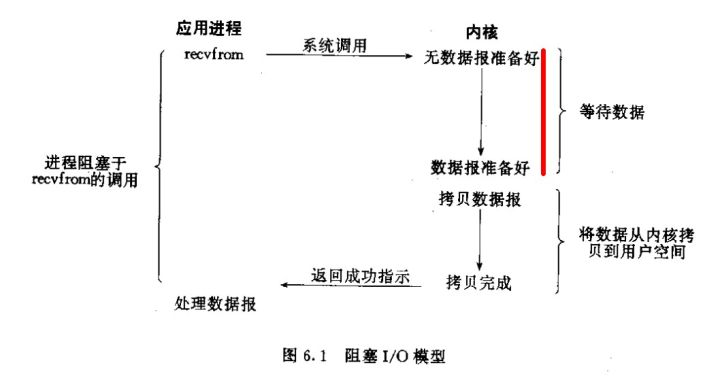

# 现代前端与传统前端开发模式上有什么不同？

传统前端：依赖jquery，美工，切图仔，门槛低。
现代前端：

* 新标准 HTML5， CSS3，ES6
* 新框架 Angular & React & Vue & Bootstrap & ..
* 新工具 Grunt & Gulp & Webpack & ...
* 新语言 Sass & Less & Typescript... 

在其他领域也引起了热烈讨论

* 桌面端： Electron
* 移动端： Ionic & React Native & ...
* 服务端： Node
* 模块化：CommonJS & SeaJS & Webpack & ...
* 增强版：Dart & Typescript & ...
* 编辑器：Webstorm & sublime & atom & ...
* 排版领域： Markdown

参考 https://www.jianshu.com/p/b213fd68430b

# 命令式编程 与 声明式编程 有何不同？

* 命令式编程：告诉机器事情要怎么做。
* 声明式编程：告诉机器想要什么效果。

React采用声明式编程，以render 函数为例，只要告诉他想要什么效果，不需要告诉怎么做。声明式编程减少了重复工作。

# 什么是 React Compoent? 它一般继承于什么？一般至少实现哪个方法？

React Component 是将不同UI组件分开，组件之间尽可能松耦合，以能够复用。Component有些像JS中的function, 输入参数（props），输出能够在屏幕上渲染的 React 元素。 React Component 继承于类 React.Component ，至少要实现 render方法。 

# JSX 语法对比普通 JavaScript 有何不同？它是如何解析的？（建议结合网上资料回答）

JSX 是 普通 JS 的语法扩展，允许在JS中写HTML语法。解析JSX时，遇到 < 按照HTML语法解析，遇到 { 按照JS语法解析。解析JSX时，首先借助Babel等工具将JSX代码转化成函数 h (可以自定义) 嵌套调用的结构，然后编写 h 函数，将嵌套结构调用最终返回一个层级嵌套对象，此对象即表征了DOM的结构。
参考 https://github.com/youngwind/blog/issues/103

# 阻塞调用与非阻塞调用有何不同？

阻塞调用和非阻塞调用是针对线程和进程而言，进程共有创建、就绪、运行、阻塞、终止五种状态，状态转换图如下：

当线程调用了某个需要IO请求的函数，如果暂时得不到竞争资源，操作系统会将其阻塞起来，转为阻塞态，避免浪费CPU资源，等得到了资源，再变成就绪状态，等待CPU调度运行。阻塞调用是指在调用结果返回之前，函数所在进程（线程）会陷入阻塞态，只有得到结果之后才会返回。而非阻塞调用是指即便不能立即得到结果，函数也会立即返回。以输入操作为例，一个输入操作通常包括如下两步：

* 等待数据准备好
* 从内核向进程复制数据

阻塞式IO示意如下：

非阻塞式IO示意如下：

由示意图可以看出，在阻塞IO中，函数 recvfrom 在没有拿到数据报之前不会返回，因此进程被阻塞直到拿到数据。而非阻塞IO中，函数recvfrom 即便没有拿到数据，也会立即返回。但两者都是同步操作。

参考：
https://juejin.im/entry/58ae4636b123db0052b1caf8
https://www.zhihu.com/question/19732473